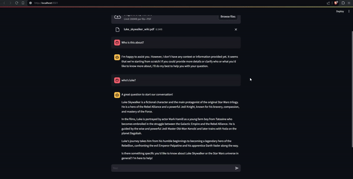

# LLama3-ChatPDF 
A local PDF Chat Application wity LLama3, Langchain, Ollama, and Streamlit. Naming things are hard and for the sake of simplicity.
## Chat with Your PDFs Locally



## Overview

This application allows you to chat with your PDF documents locally. It's built using a combination of advanced technologies to provide a seamless and interactive experience.

## Features

- **Local Processing**: All operations are performed locally to ensure data privacy and security.
- **Interactive Chat Interface**: Use Streamlit to interact with your PDFs through a chat interface.
- **Powerful Backend**: Leverage LLama3, Langchain, and Ollama for robust document processing and interaction.

## Technologies Used

- **LLama3**:  LLM for natural language processing and understanding.
- **Langchain**: To facilitate interactions and manage the chat logic.
- **Ollama**: For additional language processing capabilities.
- **Streamlit**: For building an interactive and user-friendly web interface.

## Installation

1. **Clone the Repository**
   ```bash
   git clone https://github.com/Sh9hid/llama3-chatpdf.git
   cd LLama3-ChatPDF

2. **Install Dependencies**
   ```bash
   pip install -r requirements.txt

3. **Usage**
   ```bash
   streamlit run app.

## Roadmap
Add OpenAI API key input to the app, and fix the deployment.

## Contributing
Contributions are welcome! Please fork the repository and submit a pull request for review.

## License
This project is licensed under the MIT License. See the LICENSE file for details.
